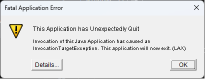
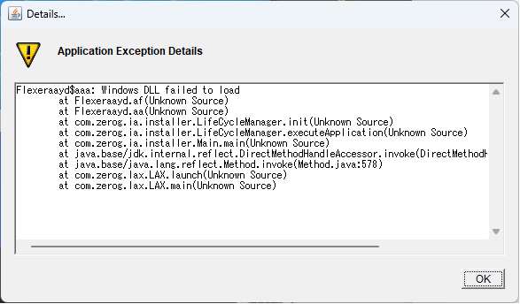
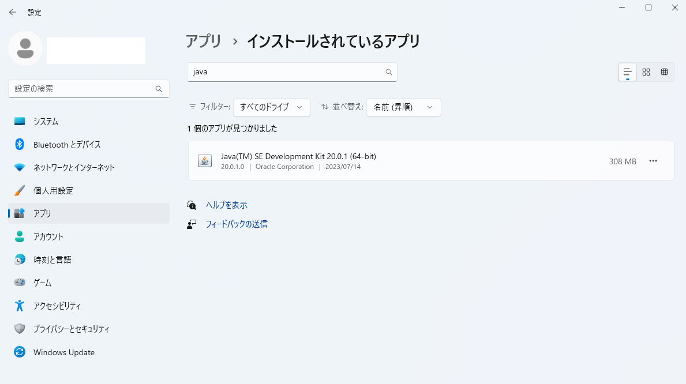
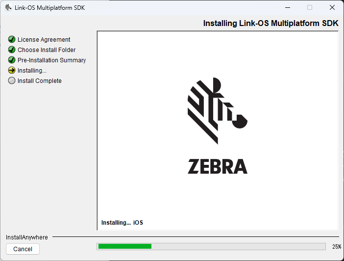
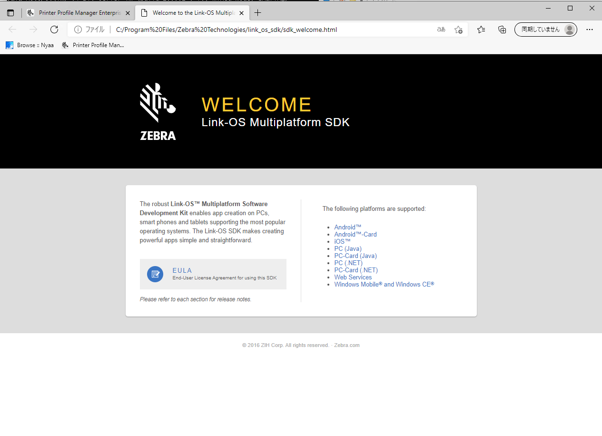

#  Multiplatform SDK のインストール時にUnExpected Errorが発生する

 

# A. 問題

一部の Windows PCにて、Link-OS Multi-platform SDKをインストールするとLAX エラー等が発生し、インストールが中断する。

 

▽ エラー例１

 

▽ エラー例２

 

▽ 詳細エラログ（例）

    Flexeraayd$aaa: Windows DLL failed to load
    at Flexeraayd.af(Unknown Source)
    at Flexeraayd.aa(Unknown Source)
    at com.zerog.ia.installer.LifeCycleManager.init(Unknown Source)
    at com.zerog.ia.installer.LifeCycleManager.executeApplication(Unknown Source)
    at com.zerog.ia.installer.Main.main(Unknown Source)
    at java.base/jdk.internal.reflect.DirectMethodHandleAccessor.invoke(DirectMethodHandleAccessor.java:104)
    at java.base/java.lang.reflect.Method.invoke(Method.java:578)
    at com.zerog.lax.LAX.launch(Unknown Source)
    at com.zerog.lax.LAX.main(Unknown Source)

 

▽ 発生環境例、

    エディション      Windows 11 Pro
    バージョン         22H2
    インストール日  ‎2023/‎07/‎03
    OS ビルド          22621.1992
    エクスペリエンス            Windows Feature Experience Pack 1000.22644.1000.0
    
    C:\Program Files\Java\jdk-20\bin>java -version
    java version "20.0.1" 2023-04-18 ★
    Java(TM) SE Runtime Environment (build 20.0.1+9-29)
    Java HotSpot(TM) 64-Bit Server VM (build 20.0.1+9-29, mixed mode, sharing)

  

# B. 原因

Windows の環境によってはJava VM（20.0.x）でSDKインストーラが正常に実行できない。

  

# C. 対処方法

JSE 8u311を用いてSDKのインストールをする。詳細な手順は下記の通り。

  

1. java runtinme のバージョンを確認する。

        C:\Users\moget>java -version
        java version "20.0.1" 2023-04-18
        Java(TM) SE Runtime Environment (build 20.0.1+9-29)
        Java HotSpot(TM) 64-Bit Server VM (build 20.0.1+9-29, mixed mode, sharing)

     

1. java runtine が1.8.0_321以上の場合はJDK をアンインストールする。

    [Windows] > [設定] > [アプリ] >  [インストールされているアプリ] > Java SE [...] > [アンインストール] 

    

     

1. "Java SE Development Kit 8u311" をインストールする。

    #### Java SE 8 Archive Downloads (JDK 8u211 and later)

    https://www.oracle.com/jp/java/technologies/javase/javase8u211-later-archive-downloads.html

    #### インストール後の確認

        C:\Users\moget>java -version
        java version "1.8.0_311"
        Java(TM) SE Runtime Environment (build 1.8.0_311-b11)
        Java HotSpot(TM) 64-Bit Server VM (build 25.311-b11, mixed mode)

     

1. Link-OS SDK をインストールする。

    #### LINK-OS MULTIPLATFORM SDK DOWNLOADS & SUPPORT

    https://www.zebra.com/us/en/support-downloads/printer-software/link-os-multiplatform-sdk.html

     

    ▽ インストール画面（例）
    

     

    ▽ インストール完了画面
    

     

1. "Java SE Development Kit 8u311"  をアンインストールする。

        C:\Users\moget>java -version
        'java' は、内部コマンドまたは外部コマンド、
        操作可能なプログラムまたはバッチ ファイルとして認識されていません。

     

1. 最新のJDKを再インストールする。

    #### JDK Development Kit 20.0.2 downloads
    https://www.oracle.com/java/technologies/downloads/

     

        C:\Users\moget>java -version
        java version "20.0.1" 2023-04-18
        Java(TM) SE Runtime Environment (build 20.0.1+9-29)
        Java HotSpot(TM) 64-Bit Server VM (build 20.0.1+9-29, mixed mode, sharing)

     

1. 手順終了

      
